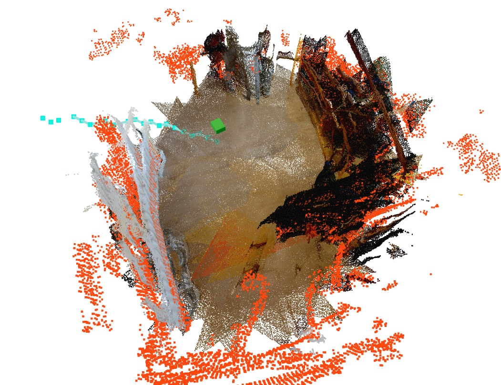
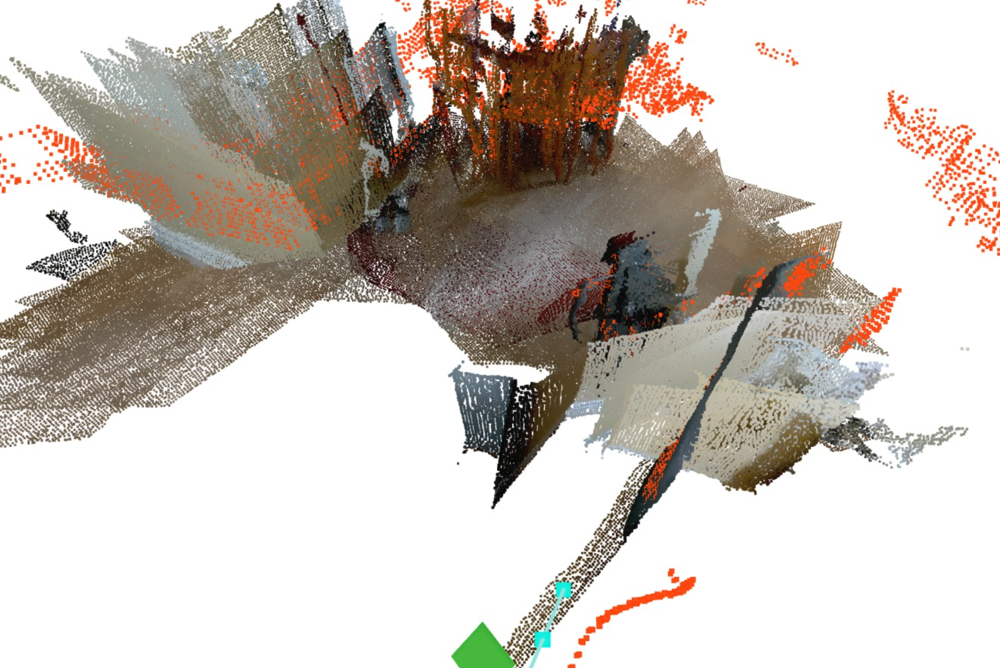
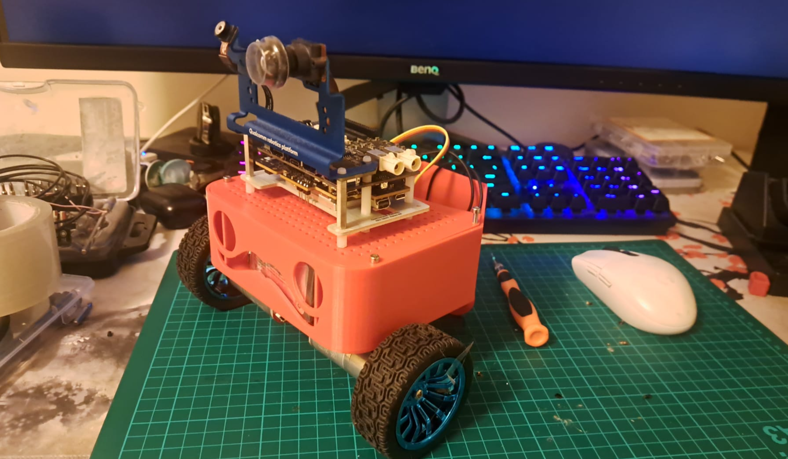

# TEQUILA

TEQUILA is a live 3D mapping and navigation system for a Qualcomm RB3 Gen 2 robot. Point a camera at a room and it turns the video into a coloured 3D point cloud, works out where the floor and obstacles are, and plans a path to explore the space, all live in a browser.

It started as a webcam-only software pipeline (still works standalone, no robot needed) and has since grown a hardware leg: a Pi Pico reading wheel encoders and a gyro, an EKF fusing that with vision, and a control panel for driving the actual robot. Two of us work on this. One on the mapping/vision side (`tequila/`), one on the odometry/EKF/firmware side (`robot_deploy/`).

It mostly works. It also still smears itself into a mess sometimes, more on that below.

## What it does

Every frame becomes a coloured point cloud that gets fused into a growing world map. The system fits a ground plane, lays a grid of waypoints across it, and marks which ones are blocked by obstacles. Then it runs A* from the robot's current position to the farthest reachable waypoint, so it keeps pushing outward into unexplored territory instead of just sitting there.

All of it streams to a browser at `http://localhost:8080` (or `http://<rb3-ip>:8080` on the robot) through [viser](https://viser.studio). Nothing to install on the viewing device, just open the page.

<p>
  
  
</p>

The green cube is the robot's current pose, the teal line is its trajectory, and the orange points are flagged obstacles. This particular run shows some of the fan-out drift mentioned below, the same wall painted into the map at a few slightly different angles.

```
Camera / Video
      │
      ▼
 CaptureThread ──► InferenceThread ──► NavmeshThread
  (grabs frames)    (depth model,        (floor fit, obstacle
                      SIFT+PnP VO,         filter, A*, runs on
                      back-projection)     its own worker thread)
                        │                    │
                        ▼                    ▼
                   Coloured map         Navmesh overlay
                        └──────────────────┘
                                 │
                            Viewer thread
                         (http://localhost:8080)
```

On the robot there's a fourth source of truth in the mix too: wheel odometry and gyro, fused through an EKF, which can drive the map instead of vision or alongside it. More on that under [Running it on the robot](#running-it-on-the-robot).

## Where things stand

Metric depth from Depth Anything V2 works well and doesn't drift in scale from frame to frame the way relative-depth models do. SIFT+PnP visual odometry handles most frames fine and falls back to ICP when a wall doesn't have enough texture to track. Floor detection (GPP sector fitting with a RANSAC fallback) copes with tilted or noisy clouds and won't lock onto the ceiling by mistake. The frontier-exploration navmesh reliably picks a far, reachable spot and paths to it, and it now commits to that goal instead of re-picking a new one every recompute, which used to make it twitch back and forth constantly. Navmesh recompute also runs on its own thread now, so a slow 1-3 second pass no longer stalls the map display.

Fisheye undistortion uses a real measured camera calibration rather than just a lens-spec approximation. On the robot side there's wheel + gyro odometry through an EKF, vision correcting its drift, and a live control panel with manual drive, motor testing, and gyro diagnostics.

Still in progress: TSDF volumetric fusion as an alternative to raw point accumulation is implemented and off by default, and it's not yet clear if it actually beats plain accumulation plus SOR for our case. Gyro calibration on the real robot (sign, scale, bias) is still mostly manual, spin it and check the printed sign in the console kind of territory.

## Current problems

The map still fans out and duplicates itself. This is the big one. If yaw drifts even a couple degrees between frames, from wheel slip, from a VO frame that barely missed its inlier threshold, from gyro bias, every frame after that gets placed at a slightly wrong angle and the same wall ends up painted into the map several times at different angles. It looks like a wall exploded outward into a fan of ghost copies. We've attacked this from a few directions: planar-motion lock so pitch and roll can't drift, tighter VO acceptance thresholds, gyro fusion so yaw doesn't depend on wheel slip at all. It's better than it was but not solved. Leave the robot sitting still on a hard floor for a few minutes and you can watch the EKF pose slowly rotate on its own. That's raw gyro bias, and it turns straight into map smearing over time.

Visual odometry still struggles on low-texture surfaces. Blank walls, dim rooms, glossy floors, SIFT just can't find enough keypoints and falls back to ICP, which is worse and more likely to get a bad fit when the geometry is ambiguous, like a long flat corridor.

The odom/VO fusion right now is a coarse toggle rather than a properly tuned filter. You can drive the map from wheel+gyro odometry or from vision, and vision nudges the EKF when it succeeds, but the measurement noise fed into that update is a rough heuristic based on inlier count, not anything we've actually characterized.

`robot_deploy/rb3/install.sh` is out of date. It still references a separate Pi bridge process (`pi/bridge.py`, a `PI_IP` setting) from an earlier architecture. The current code talks to the Pico directly over USB serial, the install script just never got updated.

And recovering from a bad map is entirely manual. If it fans out, the fix today is hit Reset Map and drive around again.

If the map in the viewer looks like a clean, recognizable room, that's the pipeline working as intended. If it looks like a wall got put through a blender, that's yaw drift, and it's the main thing left to fix.

## How it works

**Depth inference (`tequila/depth.py`).** Each incoming frame gets resized to `--width` pixels and run through Depth Anything V2 in its metric configuration, so it outputs actual distances in metres rather than a 0-1 normalized map. That matters more than it sounds like it should: a relative-depth model rescales every frame independently, so the same real-world distance maps to a different pixel value from one frame to the next, and stitching frames together turns that into a stretching, fanning mess. Metric depth sidesteps the whole problem.

Depth models also blend intermediate values at object edges, a chair leg against a far wall for example, which back-project into long spikes trailing behind every object. We remove them with a two-stage test: a pixel is flagged if it's well past its local neighbourhood minimum (an erosion test) or sitting on a sharp relative depth gradient, then the bad-pixel mask gets dilated a couple pixels to catch the blended edge pixels around it too.

If fisheye undistortion is on, we rectify the wide RB3 lens to a narrower rectilinear FOV before any of this, using either a measured calibration (`tools/camera_calibration.py`, chessboard-based) or, failing that, an equidistant-lens approximation from the spec sheet. Otherwise the pinhole back-projection math further down the pipeline would be wrong. Each frame ends up producing two point clouds: a coarse position-only one for floor detection and the navmesh, and a fine coloured one for what actually shows up in the viewer.

**Frame alignment (`tequila/odometry.py`).** To build a consistent map, every new frame has to land in the same coordinate system as everything before it. On the robot, if wheel+gyro fusion is on, the EKF's pose places the frame directly and vision isn't needed for that part. Visual odometry still runs alongside it, and whenever it finds a confident alignment it nudges the EKF back toward what the camera actually saw, correcting wheel-odometry drift as it goes.

In the default webcam/video mode, SIFT keypoints get matched between the current and previous frame with Lowe's ratio test to kill ambiguous matches, the matched previous-frame points are lifted to 3D using the stored depth map, and `solvePnPRansac` recovers the relative camera pose. A result needs at least 20 inliers, translation under 2 m, and rotation under 15° to be accepted, anything wilder gets thrown out. If that fails, usually not enough texture to match, it falls back to point-to-point ICP on the coarse clouds, needing at least 35% inlier fitness under the same shift and rotation limits.

Either way, since the robot only drives on a flat floor, the pose gets projected back onto a pure X-Z translation plus yaw manifold after alignment. Pitch, roll, and vertical drift get zeroed out every single frame instead of being allowed to accumulate.

**Map accumulation (`tequila/threads.py`).** Aligned frames get transformed into world space and merged into two running clouds: a coarse one for floor and navmesh work that's periodically voxel-downsampled and SOR-cleaned, and a fine coloured one for display, capped at a configurable max depth so distant, noisier points don't stretch into long fan arms. Both clouds are hard-capped at 500,000 points. There's also an optional TSDF volumetric fusion mode that integrates depth into a voxel grid instead of piling up raw points, averaging overlapping observations rather than letting noise stack, but it's newer and less battle-tested than plain accumulation.

**Floor detection (`tequila/navmesh.py`).** Every `--nav-interval` seconds the accumulated cloud gets split into angular sectors around the vertical axis, a plane gets PCA-fit per sector, and the largest group of sectors whose normals roughly agree becomes the floor candidate. If GPP can't find enough agreement, or if the "floor" it found turns out to be above the camera (a table, or the ceiling, usually from drift), it falls back to classic RANSAC with the camera height as a hard ceiling on where a floor is allowed to be.

**Navigation mesh and path planning.** A grid of waypoints gets laid directly onto the fitted floor plane rather than snapped to noisy floor points, so every node ends up at exactly the same height. Non-floor points in a height band above the floor become obstacles, and any node within the clearance radius of one gets blocked. Free nodes within range of each other are connected if a line-of-sight check along the edge stays clear. A* then runs from the node nearest the camera to the farthest one it can actually reach, a simple frontier-exploration strategy, and it commits to that goal across recomputes now instead of picking a fresh one every time.

## Running it on the robot



`robot_deploy/` is the RB3 Gen 2 deployment, kept separate from the core pipeline. `robot_deploy/pico/` is MicroPython firmware for the Pi Pico: it reads quadrature encoders through hardware interrupts, drives the motors, and streams encoder ticks and IMU readings to the RB3 over USB serial as newline-delimited JSON. `robot_deploy/rb3/` runs on the RB3 itself: `hardware.py` is the serial client, and `main.py` wires up an EKF2D (wheel + gyro dead-reckoning with an optional vision correction step), a pure-pursuit controller that follows the live navmesh path, and a viser control panel with manual drive, individual motor testing, and live diagnostics like EKF pose, raw gyro rate, and a stationary yaw-drift readout for spotting gyro bias.

The EKF predicts from gyro yaw rate when it's available, falling back to the noisier wheel-speed differential otherwise, and takes a measurement update from VO whenever vision gets a confident alignment. So the map can be driven by wheel+gyro odometry alone, by vision alone, or by both with vision correcting drift, and that's toggleable live from the control panel.

## Testing without a robot

`digital_twin.py` simulates the whole thing: a virtual robot in a configurable room (a few presets, office, warehouse, maze), synthetic sensors, and a raycaster standing in for the depth camera, all running the same navmesh and exploration code the real robot does. It's useful for testing navmesh and exploration changes without needing physical hardware or dragging a robot around a room.

## Project structure

```
main.py                 Entry point, CLI args, model loading, starts the viewer
digital_twin.py          Simulated robot + room for testing without hardware
tequila/
  config.py              All tunable constants
  depth.py                Depth inference, flying-pixel removal, fisheye undistortion
  pointcloud.py            Voxel downsampling, SOR, optional segmentation helpers
  odometry.py               SIFT+PnP visual odometry, ICP fallback
  navmesh.py                 GPP floor detection, node grid, obstacle filtering, A*
  threads.py                  CaptureThread, InferenceThread, NavmeshThread + queues
  viewer.py                    Viser scene updates and the main viewer loop
  tsdf.py                       Optional TSDF volumetric fusion (needs Open3D)
  hardware.py                   TCP hardware bridge, unused, predates robot_deploy/
robot_deploy/
  pico/                   MicroPython firmware: encoders, motors, IMU streaming
  rb3/                    Runs on the RB3: EKF, hardware bridge, control panel
tools/
  camera_calibration.py  Fisheye chessboard calibration
  capture_calibration.py Grab calibration images from a live camera
depth_anything_v2/      Vendored relative-depth model code, currently unused
```

## Quick start

```bash
pip install -r requirements.txt
pip install viser

# Webcam (default camera index 0)
python main.py

# Video file
python main.py --source path/to/video.mp4

# Slower CPU machine: lower resolution is roughly 4x faster
python main.py --width 640
```

Open **http://localhost:8080**. Controls: `left-drag` orbits, `right-drag` pans, `scroll` zooms, `Ctrl-C` quits.

The depth model downloads automatically on first run (~100 MB for the default Small model).

### All options

| Flag | Default | Description |
|------|---------|-------------|
| `--source` | `0` | Webcam index (int) or path to a video file |
| `--width` | `1280` | Inference image width in pixels. Use `640` on CPU |
| `--interval` | `3.0` | Seconds between webcam captures |
| `--frame-skip` | `30` | Process every Nth frame (video file mode) |
| `--nav-interval` | `1.0` | Seconds between navmesh recomputes |
| `--up-axis` | `y` | Which axis points up: `x`, `y`, `z`, or `auto` |
| `--max-tilt` | `30.0` | Max floor tilt in degrees |
| `--obs-max-height` | `0.80` | Max obstacle height above floor (metres) |
| `--no-accum` | off | Single-frame mode, no map accumulation |
| `--map-depth` | `3.0` | Max depth of accumulated map points (metres) |
| `--port` | `8080` | Viser web viewer port |
| `--no-splats` | off | Use a raw point cloud instead of Gaussian splats |
| `--splat-radius` | `0.012` | Gaussian splat radius in metres |

## Viewer legend

| Colour | Layer | Meaning |
|--------|-------|---------|
| Coloured points | `/scene/map` | Accumulated world map |
| Orange | `/nav/obstacles` | Detected obstacles |
| Red | `/nav/blocked` | Navmesh nodes blocked by obstacles |
| Yellow | `/nav/free` | Free (passable) navmesh nodes |
| Blue lines | `/nav/edges` | Passable edges between free nodes |
| Teal | `/nav/path` | A\* path to the farthest reachable node |
| Green | `/nav/trajectory` | Robot trajectory since startup |

Yellow, red, and blue debug layers are hidden by default (`NAV_PATH_ONLY = True` in config) since they clutter the view once a map has any real size to it. Obstacles and the planned path stay visible either way.

## Depth model

Default is Depth Anything V2 Metric Indoor Small (~100 MB, downloaded from Hugging Face on first run). Swap it in `tequila/config.py`:

```python
# Faster, smaller (default)
DEPTH_MODEL_ID = "depth-anything/Depth-Anything-V2-Metric-Indoor-Small-hf"

# More accurate, slower (~1.3 GB)
DEPTH_MODEL_ID = "depth-anything/Depth-Anything-V2-Metric-Indoor-Large-hf"

# Outdoor / mixed environments
DEPTH_MODEL_ID = "depth-anything/Depth-Anything-V2-Metric-Outdoor-Large-hf"
```

| Model | AbsRel ↓ | δ₁ ↑ | RMSE ↓ | Params |
|-------|----------|------|--------|--------|
| Small | 0.073 | 96.1% | 0.261 m | 24.8 M |
| Large | 0.056 | 98.4% | 0.206 m | 335 M |

Small is good enough for navigation purposes. The accuracy gap rarely matters for spotting chairs and walls at the distances a robot actually cares about.

## Performance tips

| Hardware | Recommended settings |
|----------|---------------------|
| GPU (any CUDA) | Defaults are fine |
| Mid-range CPU | `--width 640 --frame-skip 60` |
| Low-spec CPU / RB3 | `--width 640 --nav-interval 2.5` |

## Troubleshooting

| Symptom | Likely cause | What to do |
|---------|-------------|-----|
| Map fans out into ghost copies of the same wall | Yaw drift accumulating between frames | Known issue, see [Current problems](#current-problems). Reset Map and try driving more slowly/steadily |
| Very slow | No GPU, or the Large model | `--width 640`, confirm `DEPTH_MODEL_ID` is the Small variant |
| Floor detected in mid-air | Drift rotated the cloud so GPP grabbed the wrong surface | Should self-correct: GPP validates against camera height and retries with RANSAC. If it doesn't, the drift is probably too severe already |
| False obstacles on open floor | Depth noise close to the floor plane | Raise `OBS_HEIGHT_MIN` in `config.py` |
| Rays/spikes trailing behind objects | Flying pixels not fully masked | Lower `EDGE_THRESHOLD` in `config.py` |
| `path=0 nodes` in the console | No free nodes connected to the camera's position | Camera is probably boxed in by obstacles, check `OBS_CLEARANCE_R` |
| SIFT+PnP keeps failing | Low-texture environment (plain walls, dim room) | Expected. ICP fallback should catch it. If both fail, the frame gets skipped |
| EKF pose drifts while the robot sits still | Gyro bias | Check the "yaw drift (still)" readout in the control panel; this is the main open problem on the hardware side |
